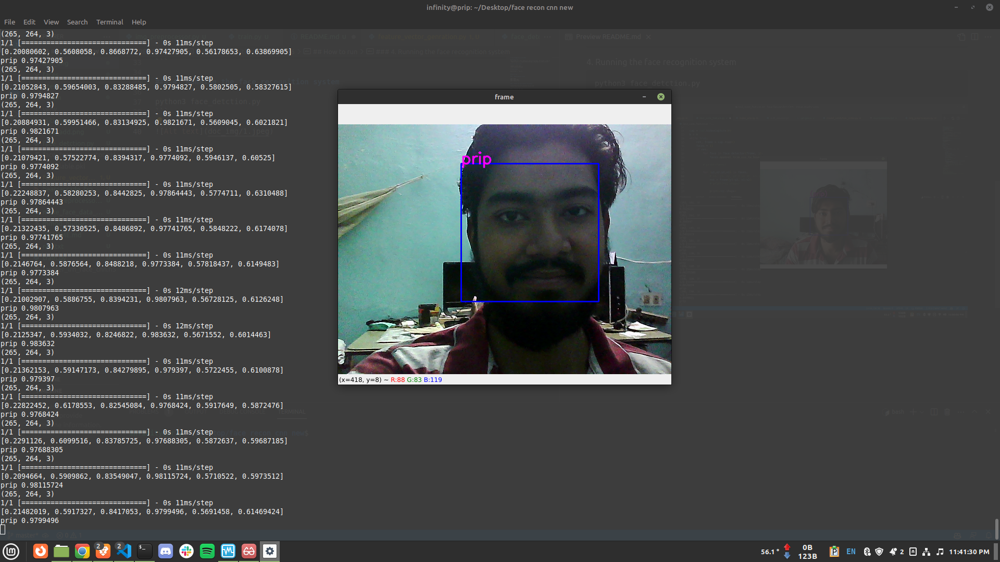
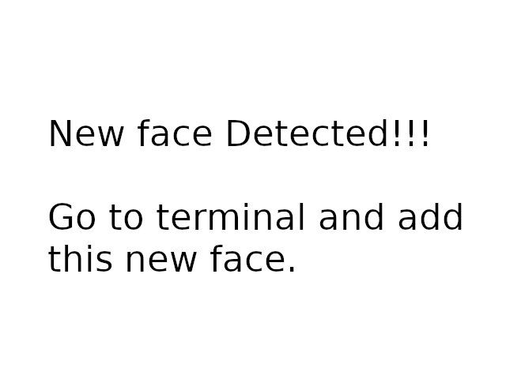

# Face Recognition using VGG16.

## 👉🏼 Introduction.
This project is a face recognition system using VGG16. The system is able to recognize faces in a video stream and draw a bounding box around the face. I use feature extraction technique to extract the features from the face and then use cosine similarity to compare the features with the features of the faces in the dataset. If the similarity is greater than 0.92 then the system will recognize the face otherwise it will show unknown.

User can add new person to the dataset if the system is not able to recognize the face. The system will prompt the user to enter the name of the person and then it will start capturing the face and train the model automatically.

## 👉🏼 Virtual Environment.
```
python3 -m venv venv
source venv/bin/activate
```
## 👉🏼 Requirements.
```
pip3 install -r req.txt
```

## 👉🏼 How to run.

### 1. Making dataset folder.
```
mkdir faces
mkdir faces/test
mkdir faces/train
```

### 2. Making the face dataset from webcam.
```
python3 make_face_data_webcam.py <person name>
```

### 3. Training the model.
```
python3 train.py
```

### 4. Feature generation.
```
feature_vector_genration.py
```

### 5. Running the face recognition system.
```
python3 face_detction.py
```

## Detected face 🤩


## 👉🏼 Adding new person if unknown face is detected.
### 1. System will prompt with.


### 2. Now go to terminal and enter the name of the person.
### 3. Program will start capturing the face and train the model automatically.

## 👉🏼 Now the system will recognize the unknown person.